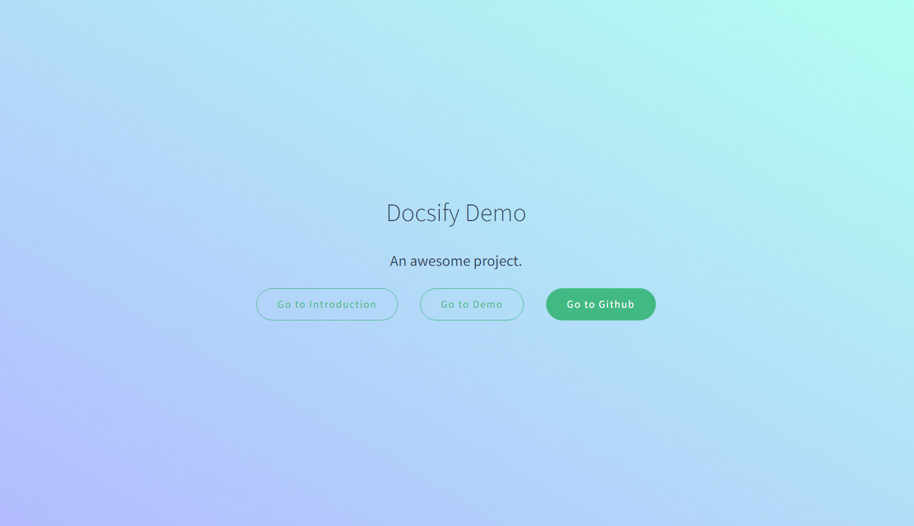

# Introduction

> 一个神奇的文档网站生成器。

## 概述

docsify 可以快速帮你生成文档网站。不同于 GitBook、Hexo 的地方是它不会生成静态的 `.html` 文件，所有转换工作都是在运行时。如果你想要开始使用它，只需要创建一个 `index.html` 就可以开始编写文档并直接[部署在 GitHub Pages](https://docsify.js.org/#/zh-cn/deploy)。

查看[快速开始](https://docsify.js.org/#/zh-cn/quickstart)了解详情。

## 特性

- 无需构建，写完文档直接发布
- 容易使用并且轻量 (压缩后 ~21kB)
- 智能的全文搜索
- 提供多套主题
- 丰富的 API
- 支持 Emoji
- 兼容 IE11
- 支持服务端渲染 SSR ([示例](https://github.com/docsifyjs/docsify-ssr-demo))

# Demo

> 一个神奇的文档网站生成器。

